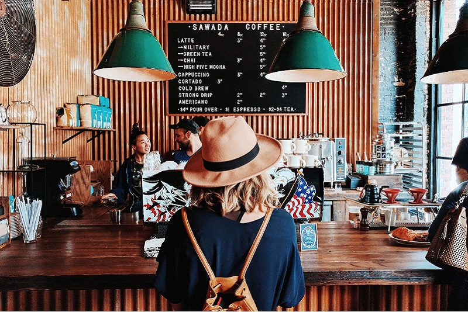

# HTML, CSS & BOOTSTRAP
## Homework #1

## Overview
   This is the first assignment for Western Oregon's Software Engineering I course. I am required to create a basic webpage on a subject of interest to me using HTML, CSS and Bootstrap. I have worked a bit within the first two items here, although this will be my first experiece working with Bootstrap. For my topic I have chosen to create a generic modern webpage layout targeting small businesses as throughout this course I will be working towards developing a small, freelance website development business to boost my resume and provide some extra income this year.
   Alright, let's get started!

## Stage One
    I started out on this project by creating and initializing a new repo for my GitHub account. I have used GitHub in the past, but I actually only just recently started using Git Bash, though it seems simple enough (I suppose I'll find out...). 
    Now that I have created a repo to store all of my files I decided to brush up on my HTML and CSS work. I had learned a lot of it during the winter break last year, though after that I didn't have much time to keep using it, so my skills are definitely rusty.
    After picking up the basics again from a course on Udemy.com, I downloaded Bootstrap and jumped into the documentation on their site. I already had something in mind for my homepage. I really wanted to keep most of the information to one page, I don’t personally enjoy jumping around from page to page on websites, so here I am going to try and keep the layout pleasant and allow the user to move around the front page with a fixed menu bar at the top of the screen.
```html
<html>
    
    <head>
        <!-- Required meta tags -->
        <meta charset="utf-8">
        <meta name="viewport" content="width=device-width, initial-scale=1, shrink-to-fit=no">

        <!-- Bootstrap CSS -->
        <link rel="stylesheet" href="https://maxcdn.bootstrapcdn.com/bootstrap/4.0.0-beta/css/bootstrap.min.css" integrity="sha384-/Y6pD6FV/Vv2HJnA6t+vslU6fwYXjCFtcEpHbNJ0lyAFsXTsjBbfaDjzALeQsN6M" crossorigin="anonymous">
        <link rel="stylesheet" href="SmallBusiness.css">
        <title>Small Business Webpage</title>
        
        
    </head>

    <body>
    
        <nav class="navbar navbar-expand-lg navbar-light">
                
            <a class="navbar-brand" href="#">Your Business Name Here!</a>
            
            <button class="navbar-toggler" type="button" data-toggle="collapse" data-target="#navbarNav" aria-controls="navbarNav" aria-expanded="false" aria-label="Toggle navigation">
                <span class="navbar-toggler-icon"></span>
            </button>
            
            <div class="collapse navbar-collapse" id="navbarNav">
            
                <ul class="navbar-nav">
                
                    <li class="navbar-item active">
                        <a class="nav-link" href="#">Home <span class="sr-only">(current)</span></a>
                    </li>
                    
                    <li class="navbar-item">
                        <a class="nav-link" href="#products">Products</a>
                    </li>
                    
                    <li class="navbar-item">
                        <a class="nav-link" href="#">Customer testimony</a>
                    </li>
                    
                    <li class="navbar-item">
                        <a class="nav-link" href="SmallBusiness-ContactPage.html">Contact</a>
                    </li>
                
                </ul>
            
            </div>
        </nav>
```
    Later on I would really like to add some JavaScript that will cause the page to automatically scroll to a specified section when the user clicks on a top menu item.
    Lower down on the page I have added a nice banner, which hopefully with the addition of some JavaScript will soon stay in a fixed postion, but allow the lower portion of the page to scroll past the image as if it were in the background.
```html
<div class="banner">
            
         
        
</div>
```
    I have also added elements from Bootstrap here. The coloumn elements make up this entire page, so the content will be flexable and responsive for all devices that access it. I actually had a bit of trouble with this at first. I should have planned everything out a little bit better but I had divided the page into multiple rows for the content, but I found this to cause the page to look messy when changing window sizes, so I refactored the code to have only one row and three columns for all of the content.
```html
<div class="row">
            
            <div class="col-sm-2 background-color">
            
                <div class="customer-example-redirect homepage-middle-content-strip" id="top-example">
                   
                    <p>non ligula. Praesent vel tempus tortor. Aenean at ultricies lectus, non sodales leo. Maecenas facilisis fringilla nisi, rhoncus tempor risus congue sed. Aliquam vel lorem velit.</p>

                </div>
                
                <div class="customer-example-redirect homepage-middle-content-strip">
                   
                   
                    <p>Aenean pulvinar pulvinar ex, vel dictum enim rutrum sit amet. Duis finibus ultrices pharetra. Maecenas vel risus id neque accumsan dignissim. Vestibulum a diam enim. Duis pharetra eleifend tortor, eget vestibulum velit interdum at. Etiam mollis ac diam sed fermentum. Sed tempor tincidunt imperdiet. Ut maximus, purus sed ultrices scelerisque, augue mauris tincidunt sapien, in consectetur velit mauris ac metus. </p>
                
                </div>
            
            </div>
```
    As you can see from the above snippits of code, I have taken latin phrases from lipsum.com in order to replicate some text content, honestly filling out fake information for this site sounded none to appealing and a waste of coding time. Though perhapts in the future it can be replaced by a customer's desired content!
    At the (current) bottom of the page is the customer review section. This will be the place for clients to highlight some of their hand-picked customer testimony. The section includes a carousel with three sections for images. This carousel is flanked by four sections for customer blurbs and profile photos.
```html
<div id="carouselExampleControls" class="carousel slide" data-ride="carousel">

    <h1 class="display-3" id="products">What we deliever.</h1>
    <br>

     <p class="lead">Professional and innovative designs to get your business off the ground and customers raving about your products.</p>
     <hr class="my-4">

     <div class="carousel-inner">
        <div class="carousel-item active">
            
        </div>
        <div class="carousel-item">
            
        </div>
        <div class="carousel-item">
            
        </div>
    </div>
    <a class="carousel-control-prev" href="#carouselExampleControls" role="button" data-slide="prev">
        <span class="carousel-control-prev-icon" aria-hidden="true"></span>
        <span class="sr-only">Previous</span>
    </a>
    <a class="carousel-control-next" href="#carouselExampleControls" role="button" data-slide="next">
        <span class="carousel-control-next-icon" aria-hidden="true"></span>
        <span class="sr-only">Next</span>
    </a>
                          
</div>

               
<div class="col-sm-2 background-color">
            
    <div class="customer-example-redirect homepage-middle-content-strip" id="top-example">
        
        <p>non ligula. Praesent vel tempus tortor. Aenean at ultricies lectus, non sodales leo. Maecenas facilisis fringilla nisi, rhoncus tempor risus congue sed. Aliquam vel lorem velit. Nullam metus ante, tincidunt non tortor non, porttitor convallis erat. Praesent eget tellus eget nisl tincidunt interdum. Curabitur at sodales magna. Morbi eget pellentesque nibh, nec dapibus arcu. Mauris ut libero quis leo porta mollis nec id diam. Etiam viverra, massa nec hendrerit molestie, enim ante faucibus nulla, ut semper ipsum elit et justo</p>
                
    </div>
            
    <div class="customer-example-redirect homepage-middle-content-strip">
        
                
        <p>Non ligula. Praesent vel tempus tortor. Aenean at ultricies lectus, non sodales leo. Maecenas facilisis fringilla nisi, rhoncus tempor risus congue sed. Aliquam vel lorem velit.</p>
    </div>
</div>
```

