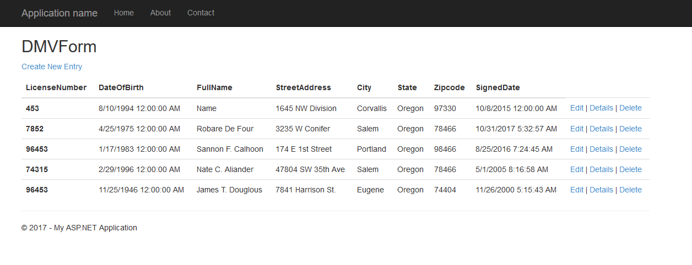
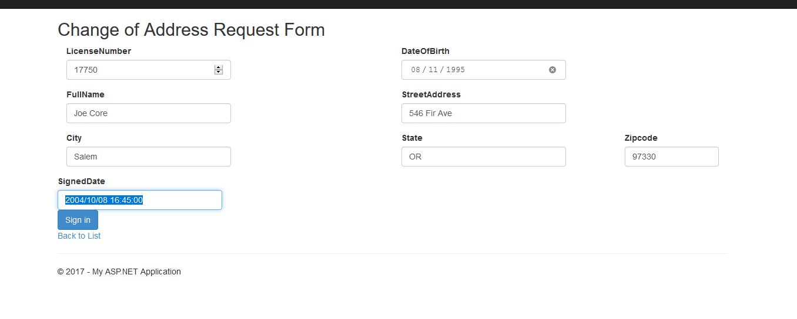
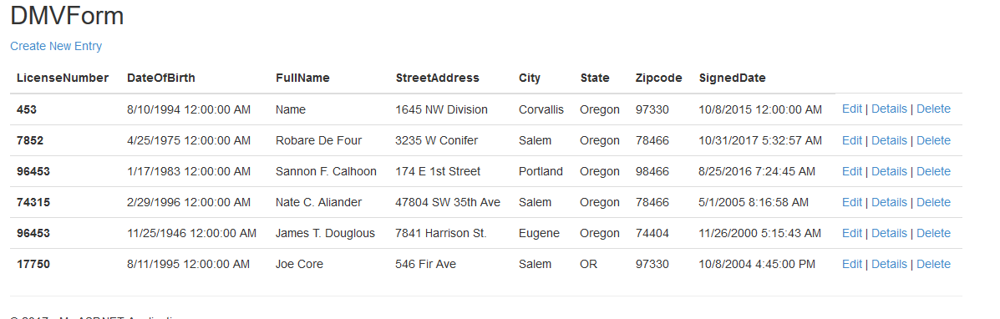

# ASP .Net MVC 5 w/ Code First Database

## Homework #5
[Homework Repo](https://github.com/sonicScape211/sonicScape211.github.io/tree/master/460hw/hw5)

[Back to the Homepage](../../)

[Previous](../hw4)
[Next](../hw6)

### Overview
In this section of the blog we are going to talk about the ASP .NET MVC Code First database that we have created! Man....I am not going to lie, I ran into quite a few issues with this. There will be a few key things I am going to talk about here: how we create the database, how the Controller talks to both the View and the Model to display and log results and how names really matter!

Alright, let's dive in.

### Your Database

Alright so we begin this project by creating a simple controller and view for the database to be at. I wont go into this because we have already gone over that process at length in the previous posts.

Then we are going to create some SQL files for our initial set up of our data base and the tare down of that database. I just used brackets to create these files and then saved them within the App_Data folder of my project. I then used App_Data > Add Existing Item... > then selected the .sql files I had created. Here is the db_UP.sql file:
```sql
CREATE TABLE [dbo].[DMVEntries] (
    [ID]            INT            IDENTITY (1, 1) NOT NULL,
	[LicenseNumber]	INT			   NULL,
    [DateOfBirth]   DATE		   NOT NULL,
    [FullName]      NVARCHAR (MAX) NOT NULL,
    [StreetAddress] NVARCHAR (MAX) NOT NULL,
    [City]          NVARCHAR (MAX) NOT NULL,
    [State]         NVARCHAR (MAX) NOT NULL,
    [Zipcode]       INT            NOT NULL,
    [SignedDate]    DATETIME       NULL,
   
);
```

and then the db_DOWN.sql file:

```sql
IF EXISTS
(
    SELECT *
    FROM sys.tables
    WHERE tables.name = 'DMVEntries'
)
BEGIN
    DROP TABLE dbo.DMVEntries
END
```

Now it is very important to note that we create a table with the puralized form of the name of our Model class! I and my other class mates had run into this problem and it took a very long time to figure out why the databases were not populating. Oddly enough VS will actually accuratly convert the Model DMVEntry to DMVEntries when it is making a table.

Alright now that we have some files we need to create a database for those files to effect. I created this from the same window as I added the SQL files from.
We make sure that the Database is connected from the Server Explorer window and the Modify Connection option on the Database. We need to make sure we are using the .mdf file we created as the Database File Name and also that we have updated the connectionString in the Web.config class. Then we can test our connection!

Another important thing that will need to be done is the creation of a Data Access Layer (DAL). This will facilitate the creation of a list to display to the user which has been created from the database we have populated.

```csharp
public class DMVEntryContext : DbContext
    {
        //Set the name for the dbContext element. This will apear in the Web.config file.
        public DMVEntryContext() : base("name=MyDB")
       {}

        //Create the list of records within the database.
        public virtual DbSet<DMVEntry> DMVEntries { get; set; }

    }
```

This class will need the code `using System.Data.Entity;` at the top in order to access the built in Entity Framework class in MVC. 

Here is a quick look at the Models class that will work with the database we have created.

```csharp
public class DMVEntry
    {
        public int ID { get; set; }

        public int LicenseNumber { get; set; }

        public DateTime DateOfBirth { get; set; }
        [Required]
        public string FullName { get; set; }
        [Required]
        public string StreetAddress { get; set; }
        [Required]
        public string City { get; set; }
        [Required]
        public string State { get; set; }

        public int Zipcode { get; set; }

        public DateTime SignedDate { get; set; }
```

This will create/use a table called DMVEntries.

After we have populated our tables and can get everything to display in the page we will need to implment a way to create new additions to the database. This can be done with in an `[HttpPost]` request.

```csharp
[HttpPost]
        //Validate the AntiForgeryToken incoming from the post request.
        [ValidateAntiForgeryToken]
        public ActionResult Create([Bind(Include = "LicenseNumber, DateOfBirth, FullName, StreetAddress, City, State, Zipcode, SignedDate")] DMVEntry newEntry)
        {
            if (ModelState.IsValid)
            {
                //Add the new entry to the IEnumerable list.
                db.DMVEntries.Add(newEntry);
                db.SaveChanges();
                //Return the updated view.
                return RedirectToAction("Index");
            }
            return View(newEntry);
        }
```

There is so much going on with this code, honestly I had to be very, very careful while stepping through all of it to make sure I understood how everything was working together.

There is also some new additions to our Razor repitour

```csharp
@Html.LabelFor(model => model.LicenseNumber)
                @Html.EditorFor(model => model.LicenseNumber, new { htmlAttributes = new { @class = "form-control", @type = "number", @placeholder = "License Number"} })
                @Html.ValidationMessageFor(model => model.LicenseNumber, "", new { @class = "text-danger" })
```

This is a really awesome way to collect user input and validate it. We are able to use lambda functions to get and pass in information to the model (here it is DMVEntry).

Also note the use of the `new {htmlAttributes = new {@class.....}}` This is a really great way to create your bootstrap forms within the Razor Syntax.

### How does the Controller fit in?

So the way that the controller operates all of this code is that it will first create a DAL db instance. This DAL will be created from the db that we set up and then the DAL will create the `DbSet<yourModelClass>` to create a table in which all your data is stored. After this the controller uses the DbSet to create a list and then returns that list to the `View()` to display our list of elements.

## Screen Shots
### Initial Table


### Before Form Submition


### After Form Submition



[Back to the Homepage](../../)

[Previous](../hw4)
[Next](../hw6)
