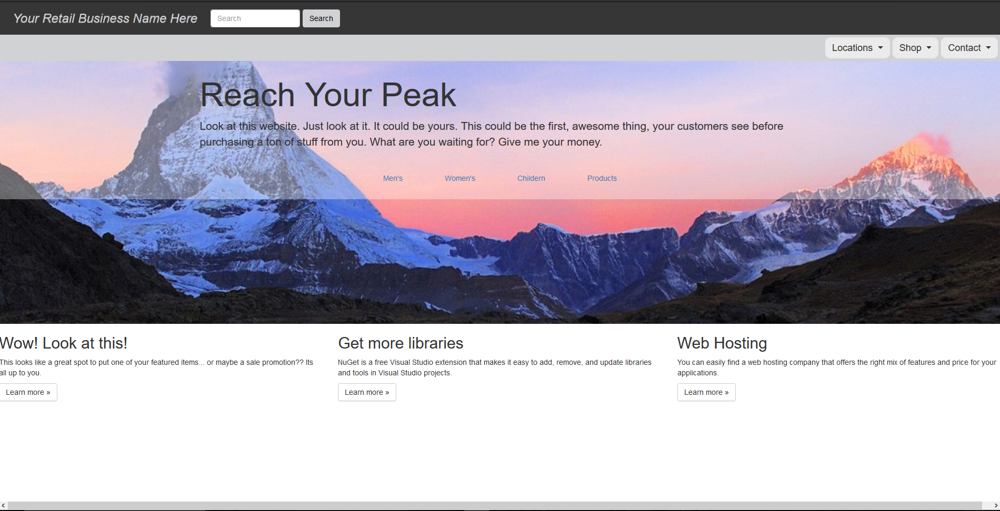

# Code First With An Existing Database.

## Homework #6
[Homework Repo](https://github.com/sonicScape211/sonicScape211.github.io/tree/master/460hw/hw6)

# Albums of Homework #6
    * [Duke Ellington - The Hits](https://www.youtube.com/watch?v=k3LLKLdYJGA)
    * [Jinsang - Solitude](https://www.youtube.com/watch?v=GSdYPkgCvtE&t=73s)

[Back to the Homepage](../../)

  [Previous](../hw5)
  [Next](../hw7)

### Overview

  While spending long nights and days coding these projects I have found that I am consistantly looking for new and better ways of keeping myself awake, alert and focused. In the spirit of that I will be adding a new section to these blog posts: Popular Albums of Homework #x...! Here is a chance for you to be able to take a listen to some new music along with me as you read through the code sections and the blog post. Happy listening! :)
  
Wow, this was a really great assignment! I felt like my skills in JavaScript, MVC, AJAX, and LINQ all really improved!
Unfortunately, this lab did take the longest to complete as I ran into several issues. Though we over came each one. Alright, with that let's dive into our solution.
 
### Loading Up the DB

For this project we were required to use Code First with an Existing Database and the database we used was one from Microsoft's example db's called Adventure Works 2014.

After downloading the .zip file to my machine and unloading the .bak file I had to create a couple of sql queries to retrieve all of the data. After a bit of searching though Microsofts blogs I found what I was looking for. The first query looked something like this (in retrospect I should have saved these specific queries to another file for use later.)

```sql
RESTORE DATABASE yourDBName
FROM DISK = ‘c:\pathToBakFile’
GO
```

Now we have our logical names for the .mdf file and .ldf and we can run:

```sql
RESTORE DATABASE yourDBName
FROM DISK = ‘c:\pathToBakFile’
WITH MOVE ‘logicalNameOfDatabase’ to ‘c:\pathToAppDataProjectFolder\yourNamedDB.mdf
MOVE ‘logicalNameOfLogFile’ to ‘c:\ pathToAppDataProjectFolder \yourNamedDB.ldf’

```

I had a bit of a slip up here and moved my files to the location of the .zip rather than the appData folder of my MVC App. This obviously caused issues.

After this I was able to reverse engineer the database to create the model classes that I would need for the rest of the project.


### Webpage Style

For the actually design of my webpage I got some inspiration from a couple of websites: [Marmot](https://www.marmot.com/) and [REI](https://www.rei.com/), I also really wanted to tackel getting a Parallex effect on the homepage (this was something I was working on in Lab#2 but could never get it to work). Here is a quick snippet of the code that was able to achieve this effect.

```css
.parallex {
    background-image: url("SitePhotos/homepage-banner.jpg");

    height: 500px;

    background-attachment: fixed;
    background-position: center;
    background-repeat: no-repeat;
    background-size: cover;

}
```

After creating the actual homepage template to get started with I starting messing around with some of the functionality. I knew that I would want my page to have a couple of buttons in the middle of the page for the user to click on and bring up the categories that they could select. In order to do this I just created a div to hold the categories and then accessed the Product model to get all of the availible categories.

```html
<div id="products-dropdown" class="banner-dropdown">
      
                <ul class="col-md-6">

                    @foreach (var item in Model.ProductCategory)
                    {
                        <li class="nav-item">

                            <button value="@Html.DisplayFor(modelItem => item.Name)" class="product-categories-link" style="margin-bottom: 10px;">
                               
                                @Html.DisplayFor(modelItem => item.Name)
                                        
                            </button>

                        </li>
                    };

                </ul>
```

In order to display both the ```Product.ProductCategories``` and the ```Product.ProductSubcategories``` I needed to create a ViewModel to encapsulate all the information.

#### ProductCategoriesViewModel:
```csharp
	namespace Lab6.Models.ViewModels
{
    public class ProductCategoriesViewModel
    {
        public IEnumerable<ProductCategory> ProductCategory { get; set; }
        public IEnumerable<ProductSubcategory> ProductSubcategory { get; set; }
        public IEnumerable<ProductSubcategory> BikesSubcategory { get; set; }
        public IEnumerable<ProductSubcategory> ComponentsSubcategory { get; set; }
        public IEnumerable<ProductSubcategory> ClothingSubcategory { get; set; }
        public IEnumerable<ProductSubcategory> AccessoriesSubcategory { get; set; }
    }

}
```

And then call and populate the ViewModel in the HomeController with:

```csharp
public ProductCategoriesViewModel CreateViewModel(ProductCategoriesViewModel viewModel)
        {

            viewModel.ProductCategory = db.ProductCategories.ToList();
            viewModel.ProductSubcategory = db.ProductSubcategories.ToList();
            viewModel.BikesSubcategory = db.ProductSubcategories.Where(c => c.ProductCategory.Name == "Bikes").ToList();
            viewModel.ComponentsSubcategory = db.ProductSubcategories.Where(c => c.ProductCategory.Name == "Components").ToList();
            viewModel.ClothingSubcategory = db.ProductSubcategories.Where(c => c.ProductCategory.Name == "Clothing").ToList();
            viewModel.AccessoriesSubcategory = db.ProductSubcategories.Where(c => c.ProductCategory.Name == "Accessories").ToList();


            return viewModel;
        }
```

I did run into an issue with displaying my found categories into different ```divs``` for each subcategory. Though my I found a way to easily swap views which is also reusable! I used this JavaScript on both the dropdowns from the nav-banner and the dropdowns for the subcategories.

```javascript
function swapDivVisibility(button, divContainer)
    {
        /*
            This will get get the drop down menus which are equal to the index of
            the button pressed. ie. mens-drop-down is in index 0 of the ul. This will get
            the div which is in the 0 index position of the banner-drop-downs container.
        */
        var $dropDown = $(divContainer).children().eq($(button).parent().index());

        //Toggle that divs visibility
        $dropDown.toggle();
        //Hide the rest.
        $dropDown.siblings().hide();
    }
```

This code is based off of the indexes that are assigned to each list item on the html page.

So as to not make this blog post too long I am going to jump into the last few details that I found important about this lab. 

### AJAX

I had a bit of difficulty here and honestly probably could have found a way around this without using an ajax.post call, but I knew we would be moving on to AJAX for the next project so I figured I would fight through it to gain some understanding before the next lab. 

I am using $.ajax in my JavaScript file to assist in handling a button click on the subcategory that the user wants to search. The first lesson I learned was that the ajax post has a callback function which is not great when paired with a Controllers call to a new view if you want to keep the Model you are passing intact. The issue I ran into was the result of my Controller passing the correct model to the view but then nothing actually being displayed in the view. This is because ajax will override the ```return View(yourModel)``` line and will instead, take that data and attempt to do something with it in its callback function. To achieve the result that I wanted here I needed to take that data the controller passed to ajax and then change the window location of the webpage and pass the html information along to it (the controller was passing all of the html information to the ajax success function). One thing to note is that the call to the ```window.location.href``` section needs to occur before the call filling a container with the html information: ```$('#container').html(response);```

Here is the sample of code which worked for me:

```javascript
$(".subCategoryButton").on("click", function () {
        //This will get the label of the specific element and set it to 
        //the name of the button for controller/POST processing.
        var buttonName = $(this).text();

        $.ajax({
            type: 'POST',
            url: "/Home/ProductsList",
            data: { subCategoryButton: buttonName },
            dataType: "html",
            success: function (response) {
                
                /*Ok so ajax does not show a call to the view if that is the result of 
                your specified POST action. It will come back to the callback function
                on success or failer. This is the way around this. Have the POST action
                return the view with the model included, then on success switch the url
                and window location, THEN populate the div with the response (which is the
                view html information that INCULDES the view! There. Remember that.*/
                window.location.href = "/Home/ProductsList";
                $('#container').html(response);
            }
        }).fail(function (jqXHR, textStatus, errorThrown) {
           console.log(jqXHR);
           console.log(textStatus);
           console.log(errorThrown);
        });
    });
```

### Review Page

After getting all of the products displayed everything else really just fell into place. The only other thing that I ran into was an issue with not being able to use a partal view with a different viewmodel than the main view. This was an issue in creating a user review sumbition form that was located on the details page iteself. Because I was using a view model I didn't have direct access to the model subcategories without using a ```foreach``` on every piece of code. This seemed like bad form in a place where we know that there is only one entry so I decided to just create a new view that pull only directly from the ```models.ProductReview```.

```csharp
public ActionResult SubmitReview(string id, [Bind(Include = "ProductReviewID,ProductID,ReviewerName,ReviewDate,EmailAddress,Rating,Comments,ModifiedDate")] ProductReview productReview)
        {
            //Get the id of the query string

            int productId = Convert.ToInt32(id);
            currentProductID = productId;

            if (ModelState.IsValid) {
                productReview.ProductID = productId;
                productReview.ReviewDate = DateTime.Now;
                productReview.ModifiedDate = DateTime.Now;

                db.ProductReviews.Add(productReview);
                db.SaveChanges();

                return RedirectToAction("ReviewAccepted");
            }

            return View();
        }
```

Overall this project had a TON of lessons and I have benifited from it greatly.




  
  
  [Back to the Homepage](../../)

  [Previous](../hw5)
  [Next](../hw7)
  