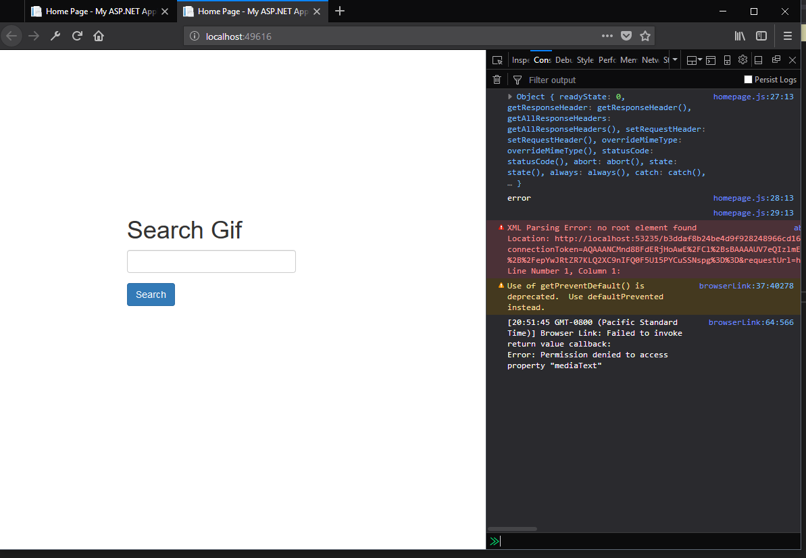

# AJAX & API Connections

## Homework #7
[Homework Repo](https://github.com/sonicScape211/sonicScape211.github.io/tree/master/460hw/hw7)

### Albums of Homework #7
[Alice In Chains - Alice In Chains](https://www.youtube.com/watch?v=xFxfHwQrVWY&list=PLJhq8uea0BmYLbvaedD_C4qDuWZLZuQSK)

[Cream - Disraeli Gears](https://www.youtube.com/watch?v=OKRYT2ptexY)

[Back to the Homepage](../../)

  [Previous](../hw6)
  [Next](../hw8)

### Overview
  
  Alright! Homework project 7. This one was a bit of a struggle that I am still working on, so expect the updates! Here was are suppose to get an API working on our webpage, though throughout this blog post you will hear more about that. For this bit we will be working with the Giphy API and creating a webpage that will search for gif images within our users specifications such as: search name, rating, static or animated gifs, ect.
  
  Alright let's dive into our solution.
  
### Creating the homepage
  
  The homepage was very simple and I have chosen to use an html form for the user input space. When the user inputs the gif they are searaching for a call is made to the AJAX JavaScript function, the user input is taken as a string and passed to the Controller as an http POST function containing the search peramaters. When the seach button is clicked this JavaScript will execute:
  
  ```javascript
  $("#search-button").on("click", function () {
    alert("here");

    search();

});

function search() {
    //Get the value out of the text element
    var searchInput = document.getElementById('search-input').value.trim();
    
    $.ajax({
        type: "POST",
        url: "/Home/Search",
        //type of data expected back from the server. .ajax will by default try and infer but we will just specify here.
        //dataType: "json",
        //Data to be passed to GET function.
        data: { searchInput: searchInput },

        success: function (data) {
            alert("Whoop");
            console.log(data);
            //alert(response);
        },

        error: function (jqXHR, textStatus, errorThrown) {
            console.log(jqXHR);
            console.log(textStatus);
            console.log(errorThrown);
        }
    });
}
  ```
  
  This function was fairly simple to implement, as I was using AJAX in the previous homework, though like I said, I ran into difficulties with the actual success of this function. Just for referenece here is the corrisponding controller code. 
  
  ```csharp
          public JsonResult Search(string searchInput) {

            //Request encrypted api key from external source.
            //NOTE this needs to be here because this key will not stick around in a field
            //and for that matter shouldn't be stored away like that.
            string apiKey = System.Web.Configuration.WebConfigurationManager.AppSettings["GiphyAPIKey"];

            string userQuery = searchInput;
            string host = "api.giphy.com";
            string path = "/v1/gifs/search";
            
            //Create the WebRequest instance by calling Create method.
            WebRequest request = WebRequest.Create("https://"+ host + path + "?q=" + searchInput + "&api_key="+ apiKey + "&limit=1");
            //Get the response from the API
            WebResponse response = request.GetResponse();
            //Get the stream of data from the server.
            Stream dataStream = response.GetResponseStream();
            //Create a reader for the data stream
            //Read it!
            string apiResponse = new StreamReader(dataStream).ReadToEnd();//reader.ReadToEnd();
            
            //Convert the JSON string to a .NET object 
     
            var serializer = new JavaScriptSerializer();

            var data = serializer.DeserializeObject(apiResponse);
            
            //Close everything up
            response.Close();
            dataStream.Close();

            return Json(data, JsonRequestBehavior.AllowGet);
        }
  ```
 
  This code will work only on occation currently, though I am looking into what is actually happening here. That being said, most of this code is in line with what we have done in the course and with what other students have been seeing results from... I will be taking up leads on this being an antivirus issue, though I am not sure that this is actually the issue that I am facing.
  
  Here is the error that I recieve:
  
  
  
  
  [Back to the Homepage](../../)

  [Previous](../hw6)
  [Next](../hw8)
 
