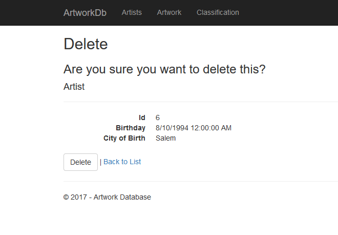

# Artist/Artwork Db - Finals Practice

## Homework #8
[Homework Repo](https://github.com/sonicScape211/sonicScape211.github.io/tree/master/460hw/hw6)

### Albums of Homework #8
[Alice In Chains - Alice In Chains](https://www.youtube.com/watch?v=xFxfHwQrVWY&list=PLJhq8uea0BmYLbvaedD_C4qDuWZLZuQSK)

[Cream - Disraeli Gears](https://www.youtube.com/watch?v=OKRYT2ptexY)

[Back to the Homepage](../../)

  [Previous](../hw7)
  [Next](../hw9)

### Overview
   Finally! We are here! The second to last project!!! This one was pretty fun, mainly due to the nature of the project. We were able to bring everything that we have learned, thus far, into this web app: cshtml, JavaScript, AJAX, CSS and many of the main component in MVC like partial views, database accessing and modifying and ViewModels.

   We needed to create a webpage from a given data model consisting of artists, relevant artworks, their classifications and their genres. Here is a look at the seed data and model we would be working with:
    

    
   I decided to tackle this project with a sectioned approch in which I would complete my data structure completely, move on to page by page functionality and then finally the last styling of the overall site. Alright, let's dive into our solution.
   
### Database + Models
   The first task here was really to decide how I wanted to implement the database. Here is my final ER diagram of the implemented database.


   I created this database in the same way as I created the one for Homework 5 with both an up script and a down script with table specifications and seeding data.


   The next section would include the was I would access this information I had just created. I created an initial model for my page to begin working with, but I quickly realized that I would not be able to just work off of this database, but would need to create a view model to edit the information availible to the user at a given time depending on their navigation through the page.


### Artist Model CRUD Functionality

   One of our requirements for this project was to make sure we had the functionality within the db web application to create, edit,view and remove members of our artist entity. This section was fairly simple at first, though I ran into an interesting problem while fufilling one of the details. We needed to make sure that we we not allowing anyone to create an artist with a birthday that was a future date. This seemed like it would be a rather simple addition, but it seems that there isn't many obvious handling tools for this in JS. After a lot of searching and experimenting I realized that I was thinking much too big and really needed to bring my focus down and take the simplest approch rather than something complicated and drawn out that will be difficulte to read later.
   
   ```javascript
   //Assistance from: https://stackoverflow.com/questions/26970867/html-beginform-using-onsubmit-to-validate
/*
This links with the html.begin from on the Artist Edit view. This will prevent anyone from editing and artist's
birthday to some date in the future. Though this is a very basic filter as users can still enter dates which are
one day behind the current date.
*/
function validateForm(event) {
    event = event || window.event || event.srcElement;
    //Get the current contents of the Birthday coloumn.
    var artistBirthday = document.getElementById("artist-birthday");
    //Set the birthday value from a string.
    var birthday = new Date(artistBirthday.value);
    //Get the current date.
    var date = new Date();

    if (birthday >= date) {
        console.log("Caught")
        $('#dateRangeErrorMessage').show();
        event.preventDefault();
    }
    else {
        $('#dateRangeErrorMessage').hide();
    }
};
```
  This code will take the input information from the user, convert it to a date format and then compare it against the current date time from the system. EASY! No need to over think this, which I caught myself doing.
  
### AJAX
In the last section we needed to use AJAX to perform page/menu navigation and display. We needed to create a user interfaces in which the user would be able to click on genres of  artwork, which would then show the art work associated with that genre and then the user could click on specific, filtered artworks to display the details of the painting. To do this I decided to pass in a partial view to my AJAX success function to provide a nice and readable controller and also allow me to reuse these menu views in other sections of the webpage later if I decided to.
```csharp
public PartialViewResult GenreSelection(int genreID) {

            var viewModel = new ArtworksViewModel();

            viewModel.Classification = dbContext.Artworks
                                 .Join(dbContext.Classifications,
                                 a => a.ArtworkID,
                                 c => c.GenreID,
                                 (a, c) => new { a, c })
                                 .Where(z => z.c.GenreID == genreID)
                                 .Select(z => z.c);
                                 
            viewModel.Artwork = dbContext.Artworks
                                .Join(viewModel.Classification,
                                a => a.ArtworkID,
                                c => c.ArtworkID,
                                (a, c) => new { a, c })
                                .Where(z => z.a.ArtworkID == z.c.ArtworkID)
                                .Select(z => z.a);

            return PartialView("_ArtworkView", viewModel);
        }
```
 Partial View:
 
 ```csharp
@model FinalPractice.Models.ViewModels.ArtworksViewModel

@if (Model.Artwork != null && Model != null)
{
    <h4>Artworks</h4>
    <ul style="list-style-type: none">
        @foreach (var item in Model.Artwork)
        {
            <li>

                <button value="@Html.DisplayFor(modelItem => item.ArtworkID)" class="artwork-button">
                    @Html.DisplayFor(model => item.ArtworkTitle)

                </button>

            </li>
        }
    </ul>
} 
   ```
   AJAX CALL
   ```javascript
$('.genre-button').on('click', function () {
    //get the value of the button just clicked.
    var genre = $(this).val();

    $.ajax({

        type: 'POST',
        url: 'Home/GenreSelection',
        data: {genreID : genre},
        dataType: 'html',
        success: function (response) {
            $('#artworks-container').html(response);
        },
        fail: function () {
            console.log("Failed in AJAX");
        }

    });

});
```
 Overall this project was really enjoyable. It gave me a chance to really improve on my skills with this aspects of webapp development. Rather than focusing on learning and retaining syntax, I was able to look towards design issues and project planning which made this lab go much smoother!
 
 
### Homepage


### Artist Edit





### Details


### Artworks


### Classifications

 
  [Back to the Homepage](../../)

  [Previous](../hw7)
  [Next](../hw9)
 
