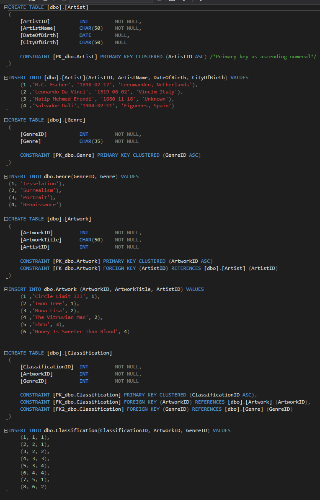

# Deployment/Publishing to Azure

## Homework #9
[Homework Repo](https://github.com/sonicScape211/sonicScape211.github.io/tree/master/460hw/hw6)

### Albums of Homework #9
[Led Zeppelin - Physical Graffiti : Black Country Woman](https://www.youtube.com/watch?v=pYcQeAnUmNA)

[Greta Van Fleet - From The Fires](https://www.youtube.com/watch?v=NMLrVKZXdvE)

Honestly if you only listen to one of these then make it these guys. This is the closest thing to Led Zeppelin that you will find right now and these guys are just getting started. 

[Back to the Homepage](../../)

  [Previous](../hw8)
  Next

### Overview
   Ok....This is actually it! Last one! This will be a pretty short blog post too and not just because it is 3:30 in the morning, but because pushing homework#8 out to Azure wasn't too difficult, but anyways.. One last time (for now)-- lets dive into our solution.
   
### Azure!
   
   So first things first. We need to create an account to be able to actually use this service. After this in order to really start using this we will go into Visual Studio to the project we want to deploy. Go to the project in the Solution Explorer, right click and select ```publish```. 
   

   
   From here we will see a navigation asking what we want to do. We will want to go to ```Create new profile```
   


   Next we will see a wizard prompting us to select if we want to create a new publish target or just use an existing one. Lets do a new one and create a new database with it! This data base will need to be provided the same connection string that you used in your local database! Remember that, it's important. 
   


   
   After we have created our database and server for Azure we will be able to publish this application. But it isn't exactly working yet so don't go too far. After the publish we will open up SQL Server Management Studio and connect to the Azure database you just created by providing the fully quailified server name and your admin username/password. With this we will have access to editing the Azure database. 
   
   
   
   Taking the UP script you want to run in a new query on the database, we will be left with the same data that we began with in Lab#8! Whoo! 
   
   
   
   Updates are almost automatic to Azure so no worries there, just closer it down and then go to Azure. We will want to just double check that all the connection strings are correct in the application settings and then make sure to set your firewall specs in the 'set server firewall' in the SQL Database tabs to the left of the database.
   
   Alright! We are good to go! Go ahead and hit the link to checkout my Azure deployed Website!
   
  [My Webpage - ArtworksDb](http://cs460homework8.azurewebsites.net

  [Back to the Homepage](../../)

  [Previous](../hw8)
  Next
